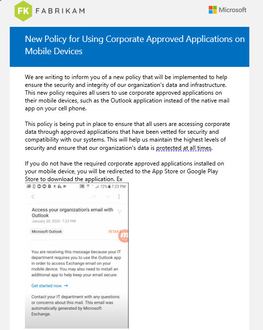

# CIS Mapped to M365

**Introducing the Comprehensive Security Baselines Guide mapped to CIS Controls**

Are you looking to take your organization's cybersecurity to the next level? When the Cybersecurity & Infrastructure Security Agency (CISA) released the [Secure Cloud Business Applications (SCuBA) project](https://www.cisa.gov/sites/default/files/publications/FINAL-CSSO\_SCuBA\_Fact\_Sheet.pdf), I was thrilled. However, I quickly realized that I needed more than just a checklist to truly implement robust security measures.

That's why I took it upon myself to create the ultimate guide for securing your Azure AD, Teams, Exchange, SharePoint, OneDrive, and Intune environments. The result is the docs that you can find in the [Broken link](broken-reference "mention") section of this repository. &#x20;

I'm also have a premium version of the guide, packed with additional valuable resources:

1. Mapping to Industry Standards: Get a clear understanding of how the suggested policies align with widely recognized cybersecurity frameworks such as the **CIS Controls and CIS Benchmarks.** This invaluable feature helps you connect the dots and ensures compliance with industry standards. Example Matrix:&#x20;

<figure><figcaption></figcaption></figure>

2. Ready-to-Use Templates: Save time and effort by utilizing our collection of professionally crafted **end-user notification templates**. These templates streamline your communication process, ensuring that your team is well-informed about security practices and protocols. Example template:&#x20;

<figure><figcaption></figcaption></figure>

### Get your copy of the premium guide [here](https://buy.stripe.com/dR62bV3kz0sP6swaEN)
