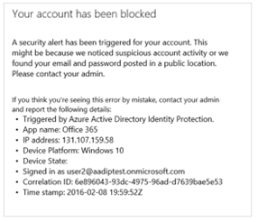

# High Risk Sign-Ins Shall Be Blocked

## Description

Azure AD Identity Protection uses various signals to detect the risk level for each user sign-in. Sign-ins detected as high risk are to be blocked via Conditional Access.

## Policy

* Sign-Ins detected as high risk shall be blocked.
* Notifications will be sent to admins when high-risk sign-ins are detected.

## Licensing Considerations

Azure AD P2. Can be purchased standalone or part of the following bundles:

* EMS + E5
* Microsoft 365 E3
* Microsoft 365 E5

## Set Up Instructions

1. Create a conditional access policy for Sign-In risk: [Risk policies - Azure Active Directory Identity Protection - Microsoft Entra | Microsoft Learn](https://learn.microsoft.com/en-us/azure/active-directory/identity-protection/howto-identity-protection-configure-risk-policies)
2. Under Access Controls> Grant, select Block Access
3. To Create notifications for admins: [Azure Active Directory Identity Protection notifications - Microsoft Entra | Microsoft Learn](https://learn.microsoft.com/en-us/azure/active-directory/identity-protection/howto-identity-protection-configure-notifications)

Identity Protection Overview: [Azure Active Directory Identity Protection notifications - Microsoft Entra | Microsoft Learn](https://learn.microsoft.com/en-us/azure/active-directory/identity-protection/howto-identity-protection-configure-notifications)

## End-User Impact


Level: <mark style="color:red;">High</mark>


Once a respective conditional access policy is implemented, if a high-risk user attempts to login, the user will receive an error message with instructions to contact the administrator to re-enable their access.

<figure><figcaption></figcaption></figure>

If after implementing this, it is observed that numerous legitimate user sign-ins are consistently being blocked due to their location being interpreted as suspicious and this creates an operational burden on the agency, then a [Trusted Location](https://learn.microsoft.com/en-us/azure/active-directory/conditional-access/location-condition#ip-address-ranges) can be configured in the Conditional Access blade for each of the legitimate sign-in locations. Azure AD Identity Protection considers the Trusted Location data when it calculates sign-in risk, and this may help to prevent users signing in from legitimate locations from being flagged as high risk.


Tips

Investigate the risk event following these steps: [Investigate risk Azure Active Directory Identity Protection - Microsoft Entra | Microsoft Learn](https://learn.microsoft.com/en-us/azure/active-directory/identity-protection/howto-identity-protection-investigate-risk)


## PowerShell Scripts

• None Currently

## Videos


