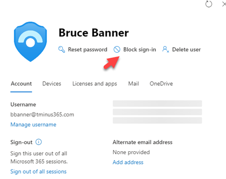

# Inactive accounts shall be blocked or deleted

## Description

Deleting or blocking accounts that haven't been used for over 30 days helps prevent unauthorized use of inactive accounts. These accounts can be targets for attackers who are looking to find ways to access your data or move laterally throughout an organization without being noticed.

## Policy

* Inactive accounts shall be blocked or deleted.
* Users who leave the organization shall have their account switched to a blocked state immediately.

## Licensing Considerations

To gather the user’s last sign in from the Audit logs, you will need an Azure AD P1 subscription which can be purchased standalone or as part of the following bundles:

* Microsoft 365 Business Premium
* EMS+ E3 or EMS + E5
* Microsoft 365 E3
* Microsoft 365 E5

You will want to search for users who haven't signed-in within 30+ days.&#x20;

Any Microsoft Licensing supports blocking sign-in.&#x20;

## Set Up Instructions

Manage inactive user accounts in Azure AD: [How to manage inactive user accounts in Azure AD - Microsoft Entra | Microsoft Learn](https://learn.microsoft.com/en-us/azure/active-directory/reports-monitoring/howto-manage-inactive-user-accounts)

**Blocking Sign-In**

1. Go to [https://admin.microsoft.com/](https://admin.microsoft.com/)
2. Click Users>Active Users
3. Select the account you want to block
4. Click Block sign-in at underneath the account name

## End-User Impact


Level: <mark style="color:green;">None</mark>


If accounts are truly dormant, there should be no impact to end-users. Proper validation is required before blocking or deleting accounts.


Tips

Block user accounts after someone leaves the organization. Develop a retention policy that defines how long you will keep the account before removing completely.


## PowerShell Scripts

Leveraging Graph API: [How to manage inactive user accounts in Azure AD - Microsoft Entra | Microsoft Learn](https://learn.microsoft.com/en-us/azure/active-directory/reports-monitoring/howto-manage-inactive-user-accounts).

[Find Azure AD Inactive Users using Powershell and Graph - Azure365Pro.com](https://www.azure365pro.com/find-azure-ad-inactive-users-using-powershell-and-graph/)

## Videos

None Currently
