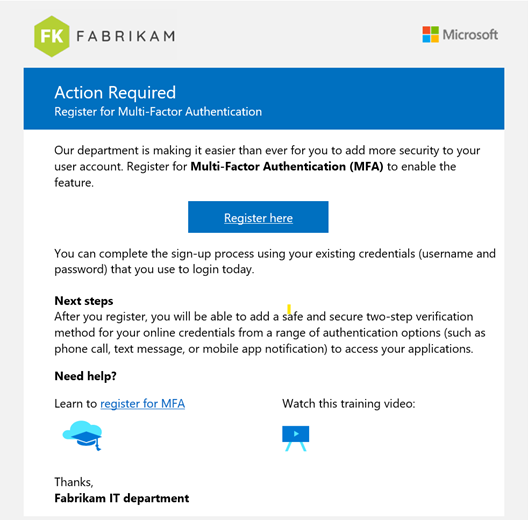

---
layout:
  title:
    visible: true
  description:
    visible: false
  tableOfContents:
    visible: true
  outline:
    visible: true
  pagination:
    visible: true
---

# MFA Shall Be Required for All Users

## Description

MFA, or multi-factor authentication, is a security measure that requires users to provide multiple forms of identification to gain access to a system or network. By enforcing MFA within an organization, companies can better protect themselves against cyber threats, such as hacking and identity theft.

At a minimum, users with privileged roles such as Global Administrators should have MFA enforced. Where possible, phishing-resistant MFA should be required for all users. Phishing-resistant multifactor authentication protects against sophisticated phishing attacks. Phishing-resistant MFA may not always be immediately available, especially on mobile devices. Where phishing-resistant MFA is not yet available, organization should adopt an MFA method from the list below

<figure><figcaption></figcaption></figure>

Microsoft also encourages a break-glass account to ensure that you are not accidently locked out of your organization. These accounts are referred to as emergency access accounts and should be excluded from MFA enforcement.

MFA can be enforced with per user settings, Conditional Access Policies, or Security Defaults. **Per user settings will be deprecated in January of 2024**. Since February of 2022, Security Defaults are enabled on all new tenants which requires MFA for all users. Security defaults are NOT a hard requirement for non-partner tenants but are recommended. If you have a tenant licensed with conditional access, it is recommended that you enforce conditional access policies instead of security defaults.

## &#x20;Policy

* MFA is enforced for all users
* Phishing Resistant MFA is enforced for all users
* If phishing Resistant MFA cannot be used, and MFA method from the list below shall be used temporarily
  * Microsoft Authenticator (Push Notifications)
  * Microsoft Authenticator (Passwordless-SignIn)
    * While using Microsoft Authenticator:
      * Number Matching shall be enabled
      * Geolocation shall be enabled
  * Software Tokens One-Time Password (OTP) – This option is commonly implemented using mobile phone authenticator apps.
  * Hardware tokens OTP
  * SMS and Voice shall not be used as the MFA method
  * One emergency, break-glass account shall be created and excluded from MFA enforcement
  * Accounts excluded from MFA shall be documented and include a justification reason

## Licensing Considerations

Enforcing MFA through conditional access requires an Azure AD P1 license which can be purchased standalone or through the following common plans:

* Microsoft 365 Business Premium
* EMS + E3 or EMS + E5
* Microsoft 365 E3
* Microsoft 365 E5
* OATH Hardware Tokens require Azure AD P1 or P2 Licensing

Enforcing MFA per user or through Security Defaults is available through all Microsoft Licensing Plans

## Set Up Instructions&#x20;

Requiring All users to have MFA through conditional Access:  [Require MFA for all users with Conditional Access - Azure Active Directory - Microsoft Entra | Microsoft Learn](https://learn.microsoft.com/en-us/azure/active-directory/conditional-access/howto-conditional-access-policy-all-users-mfa)

Security Defaults in Azure AD: [Providing a default level of security in Azure Active Directory - Microsoft Entra | Microsoft Learn](https://learn.microsoft.com/en-us/azure/active-directory/fundamentals/concept-fundamentals-security-defaults)

Legacy Per user MFA: [Enable per-user Multi-Factor Authentication - Azure Active Directory - Microsoft Entra | Microsoft Learn](https://learn.microsoft.com/en-us/azure/active-directory/authentication/howto-mfa-userstates)

Migrating from Legacy Per User Settings: [How to migrate to the Authentication methods policy - Azure Active Directory (preview) - Microsoft Entra | Microsoft Learn](https://learn.microsoft.com/en-us/azure/active-directory/authentication/how-to-authentication-methods-manage)

Phishing Resistant MFA:

* FIDO2 Security Key: [Passwordless security key sign-in - Azure Active Directory - Microsoft Entra | Microsoft Learn](https://learn.microsoft.com/en-us/azure/active-directory/authentication/howto-authentication-passwordless-security-key#fido-security-key-optional-settings)
* Certificate Based Authentication: [How to configure Azure AD certificate-based authentication - Azure Active Directory - Microsoft Entra | Microsoft Learn](https://learn.microsoft.com/en-us/azure/active-directory/authentication/how-to-certificate-based-authentication#steps-to-configure-and-test-azure-ad-cba)
* Windows Hello for Business: [How to configure Azure AD certificate-based authentication - Azure Active Directory - Microsoft Entra | Microsoft Learn](https://learn.microsoft.com/en-us/azure/active-directory/authentication/how-to-certificate-based-authentication#steps-to-configure-and-test-azure-ad-cba)

Password Less Sign In with Microsoft Authenticator: [Passwordless sign-in with Microsoft Authenticator - Azure Active Directory - Microsoft Entra | Microsoft Learn](https://learn.microsoft.com/en-us/azure/active-directory/authentication/howto-authentication-passwordless-phone)

Using Number matching: [Use number matching in multifactor authentication (MFA) notifications - Azure Active Directory - Microsoft Entra | Microsoft Learn](https://learn.microsoft.com/en-us/azure/active-directory/authentication/how-to-mfa-number-match)

Using Geolocation: [Use additional context in Microsoft Authenticator notifications - Azure Active Directory - Microsoft Entra | Microsoft Learn](https://learn.microsoft.com/en-us/azure/active-directory/authentication/how-to-mfa-additional-context)

&#x20;What Authentication methods are available in AAD: [Authentication methods and features - Azure Active Directory - Microsoft Entra | Microsoft Learn](https://learn.microsoft.com/en-us/azure/active-directory/authentication/concept-authentication-methods)



1\. In the Azure Portal navigate to Azure Active Directory.

2\. Select Security.

3\. Select Manage -> MFA.

4\. Under Configure, select Additional cloud-based MFA settings.

5\. Under verification options, select Notification through mobile app.

6\. If desired, to enforce Microsoft Authenticator app usage and disable third party authenticator apps usage, make sure that Verification code from mobile app or hardware token is not selected.

7\. Click Save.

8\. Go back to the Azure Active Directory home tab and select **Security.**

9\. Select Authentication Methods.

10\. In the Policies window, select Microsoft Authenticator.

11\.  For Enable, select Yes.

12\.  For Target, select All users.

13\.  In the row for the All users, click the … -> Configure.

14\. If configuring Phone Sign-in (aka Passwordless Sign-in), for Authentication mode, select Passwordless. If configuring Push Notifications, for Authentication mode, select Push. If configuring the usage of both, for Authentication mode, select Any.

a. For Require number matching, select Enabled.

b. For Show additional context in notifications, select Enabled.

15\. Select Done.

16\. Click Save



1\.  In the Azure Portal, navigate to Azure Active Directory.

2\. Select Security.

3\. Select Manage -> MFA.

4\. Under Configure, select Additional cloud-based MFA settings.

5\. Under verification options, select Verification code from mobile app or hardware token.

6\. If configuring Hardware Tokens OTP, follow the additional steps at [this link](https://learn.microsoft.com/en-us/azure/active-directory/authentication/concept-authentication-oath-tokens#oath-hardware-tokens-preview) when provisioning a user.



1\. In the Azure Portal, navigate to Azure Active Directory.

2\. Select Security.

3\. Select Manage -> MFA.

4\. Under Configure, select Additional cloud-based MFA settings.

5\. Under verification options, make sure that Text message to phone and Call to phone are disabled.



## End-User Impact


Level: <mark style="color:red;">High</mark>


End-User impact is high due to the necessary configuration steps along and prompts to fulfill MFA request. The user experience will vary depending on which MFA methods you have set up. In my [CIS section](broken-reference), I have end-user notifications available as part of the Security Baselines document.&#x20;

<figure><figcaption></figcaption></figure>


Tips:

Create a group in Azure Active Directory used to place all accounts excluded from MFA. This would be your emergency break-glass account and service accounts such as the Azure AD Connect sync service account (if you are running a hybrid environment).

If you are not able to enforce phishing-resistant MFA across all users, at minimum try to enable it for accounts with privileged roles (Global Admins, User Admins, etc.)


## PowerShell Scripts

* Per User MFA: [Security/Enable MFA.ps1 at master · msp4msps/Security (github.com)](https://github.com/msp4msps/Security/blob/master/Enable%20MFA.ps1)
* Convert from per-user MFA to Conditional Access MFA: [Move from per-user MFA to Conditional Access MFA - ALI TAJRAN](https://www.alitajran.com/move-from-per-user-mfa-to-conditional-access-mfa/)
* MFA Status Reporting (Multi-tenant): [Security/MFA Status\_Custom Control\_All Customers.ps1 at master · msp4msps/Security (github.com)](https://github.com/msp4msps/Security/blob/master/MFA%20Status\_Custom%20Control\_All%20Customers.ps1)
* [Monitoring with PowerShell: Monitoring the used MFA type for O365/Azure. (cyberdrain.com)](https://www.cyberdrain.com/monitoring-with-powershell-monitoring-the-used-mfa-type-for-o365-azure/)

## Videos




