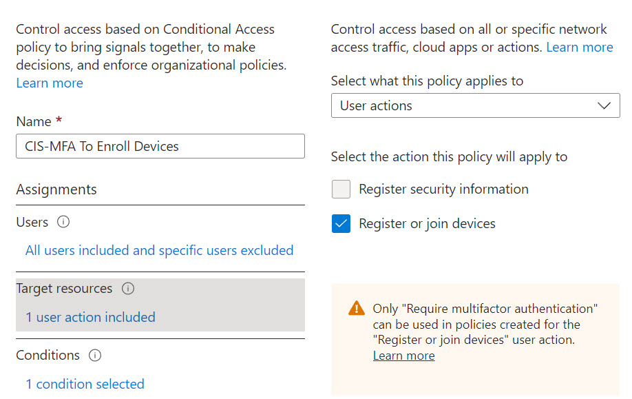

# MFA shall be required to enroll devices to Azure AD

## Description

It is recommended to enforce MFA before a user can register or join their device to Azure AD. This ensures that compromised accounts cannot be used to add rogue devices to Azure Active Directory.

## Policy

* &#x20;MFA shall be required to enroll devices to Azure AD.

## Licensing Considerations

This setting can be configured manually in all tenants via the Azure AD Portal. To enable this setting via Conditional Access, an Azure AD P1 license is required. Can be purchased standalone or part of the following bundles:

* Microsoft 365 Business Premium
* EMS+ E3 or EMS + E5
* Microsoft 365 E3
* Microsoft 365 E5

## Set Up Instructions

1. [Create a conditional access policy](https://learn.microsoft.com/en-us/azure/active-directory/conditional-access/concept-conditional-access-policies). Under **Cloud Apps or actions**, select **User Actions** from the dropdown
2. Checkmark the **Register or Join Devices options**

3. Under the grant controls, select **Require Multifactor Authentication**

## End-User Impact


Level: <mark style="color:yellow;">Medium</mark>


Users will get prompted with MFA when trying to register or join devices to Azure Active Directory. This could be through the out-of-box experience, users signing in via the company portal app, or users registering their devices through the account settings.  If the user is brand new, has not set up MFA, and tries to join a device out-of-the box, a [temporary access pass](https://learn.microsoft.com/en-us/azure/active-directory/authentication/howto-authentication-temporary-access-pass) will need to be provided which will allow them to fulfill the MFA requirement.


Tips

For users trying to join Azure AD devices as part of the out-of-box experience or prior to getting to configure MFA, [Temporary Access passes](https://learn.microsoft.com/en-us/azure/active-directory/authentication/howto-authentication-temporary-access-pass) can be leveraged to fulfill the requirement


## PowerShell Scripts

None Currently

## Videos


