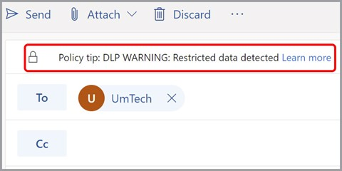

# Data Loss Prevention Solutions SHALL Be Enabled

## Description

Data loss prevention (DLP) helps prevent both accidental leakage of sensitive information, as well as intentional exfiltration of data. DLP forms an integral part of securing Microsoft Exchange Online. Microsoft offers DLP services, controlled within the Microsoft 365 compliance admin center.

## Policy

* A data loss prevention policy shall be configured that applies to Exchange Online.

## Licensing Considerations

To configure data loss prevention policies, one of the following licenses is needed:

* Microsoft 365 Business Premium
* Microsoft 365 E3/E5
* Office 365 E3/E5

## Set Up Instructions

[Data loss prevention in Exchange Online | Microsoft Learn](https://learn.microsoft.com/en-us/exchange/security-and-compliance/data-loss-prevention/data-loss-prevention)

To create a DLP policy for Exchange follow the steps listed [here](https://learn.microsoft.com/en-us/microsoft-365/compliance/dlp-microsoft-teams?view=o365-worldwide#define-a-new-dlp-policy-for-microsoft-teams)

## End-User Impact


Level: <mark style="color:yellow;">Medium</mark>


With this setting in place, users could have their email rejected depending on the policy definition. For example, if a user is trying to send sensitive information such as credit card info to an external domain, a DLP policy could kick in and block the message from being sent. The user would get a rejection email telling them why the message was blocked. They can also get messaging with policy tips before sending the email if that is configured.


Tips

• None Currenty


## PowerShell Scripts

[https://learn.microsoft.com/en-us/powershell/module/exchange/new-dlpcompliancepolicy?view=exchange-ps](https://learn.microsoft.com/en-us/powershell/module/exchange/new-dlpcompliancepolicy?view=exchange-ps)

## Videos




