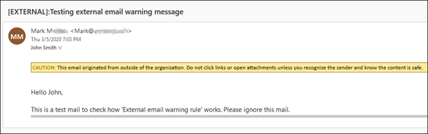

# External Sender Warnings SHALL Be Implemented

## Description

Mail flow rules allow the modification of incoming mail such that mail from external users can be easily identified, for example, by prepending the subject line with “\[External].” Seeing this message can help users identify email messages that might be spoofed and mark them as malicious.

## Policy

* &#x20;External sender warnings SHALL be implemented.

## Licensing Considerations

This setting can be configured in any Microsoft tenant with Exchange Online.

## Set Up Instructions

[Mail flow rules (transport rules) in Exchange Online | Microsoft Learn](https://learn.microsoft.com/en-us/exchange/security-and-compliance/mail-flow-rules/mail-flow-rules)

To enable external sender warnings:

1. Sign in to the Exchange admin center.
2. Under Mail flow, select Rules.
3. Click the plus (+) button to create a new rule.
4. Select Modify messages….
5. Give the rule an appropriate name.
6. Under Apply this rule if…, select The sender is located….
7. Under select sender location, select Outside the organization, then click OK.
8. Under Do the following…, select Prepend the subject of the message with….
9. Under specify subject prefix, enter a message such as “\[External]” (without the quotation marks), then click OK.
10. Under Choose a mode for this rule, select Enforce.
11. Click Save

## End-User Impact


Level: <mark style="color:green;">Low</mark>


With this setting in place, users will see a prepended message with each email they get originating outside the organization. Users should be trained to spot these messages in a combination of the from address to identify if the from address is being spoofed.


Tips

None Currently


## PowerShell Scripts

[https://adamtheautomator.com/external-email-warning/](https://adamtheautomator.com/external-email-warning/)

[https://lazyadmin.nl/it/add-external-email-warning-to-office-365-and-outlook/](https://lazyadmin.nl/it/add-external-email-warning-to-office-365-and-outlook/)

[https://learn.microsoft.com/en-us/powershell/module/exchange/set-externalinoutlook?view=exchange-ps](https://learn.microsoft.com/en-us/powershell/module/exchange/set-externalinoutlook?view=exchange-ps)

## Videos




