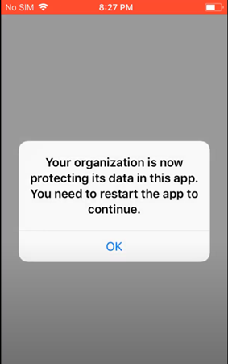

# App Protection policies should be created for mobile devices

## Description

Leveraging the mobile application management (MAM) features of Microsoft Intune, app protection policies can be created so that users can access corporate applications on mobile devices securely, without having to enroll that device into the MDM solution. These settings allow you to place additional protection on applications such as requiring a pin or preventing cut, copy, and paste to unmanaged applications. App protection policies should be configured for iOS and Android devices.

## Policy

* App protection policies are configured for iOS and Android devices

## Licensing Considerations

Any tenant with Intune licensing can access this setting.

## Set-Up Instructions

[Create and deploy app protection policies - Microsoft Intune | Microsoft Learn](https://learn.microsoft.com/en-us/mem/intune/apps/app-protection-policies#create-an-iosipados-or-android-app-protection-policy)

[Android app protection policy settings - Microsoft Intune | Microsoft Learn](https://learn.microsoft.com/en-us/mem/intune/apps/app-protection-policy-settings-android)

[iOS/iPadOS app protection policy settings - Microsoft Intune | Microsoft Learn](https://learn.microsoft.com/en-us/mem/intune/apps/app-protection-policy-settings-ios)

## End-User Impact


Level: <mark style="color:yellow;">Medium</mark>


When users go to access corporate data on a managed application like Outlook, they will receive a prompt that the devices is under corporate management. Depending on what settings are configured in the policy they might also have to a take additional action such as setting up an application pin.\


Tips

• Do not configure this setting for all apps on the device. The recommended setting is to configure all Microsoft Apps.


## PowerShell Scripts

[powershell-intune-samples/AppProtectionPolicy at master · microsoftgraph/powershell-intune-samples (github.com)](https://github.com/microsoftgraph/powershell-intune-samples/tree/master/AppProtectionPolicy)

## Videos&#x20;






