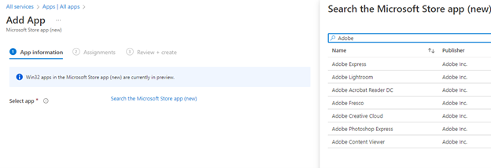

# Authorized Applications should be deployed to managed devices

## Description

An authorized application inventory should be kept for corporate approved applications. These applications should be packaged and deployed in Microsoft Intune from the applications section of the Intune Admin Center. The application lifecycle should be maintained through Intune, including the patch cycle.

## Policy

* Authorized Applications should be deployed to managed devices

## Licensing Considerations

• Any tenant with Intune licensing can access this setting.

## Set-Up Instructions

[https://learn.microsoft.com/en-us/mem/intune/apps/apps-win32-prepare](https://learn.microsoft.com/en-us/mem/intune/apps/apps-win32-prepare)

[Add Microsoft Store apps to Microsoft Intune | Microsoft Learn](https://learn.microsoft.com/en-us/mem/intune/apps/store-apps-microsoft)

## End-User Impact


Level: <mark style="color:green;">Low</mark>


This will vary depending on the applications you are pushing out. The installation package you define will determine if the application will install automatically or provide the option to the user to install the application.


Tips

• Leverage packaging tools like Winget and Chocolatey to help automate the app packaging and deployment.


## PowerShell Scripts

[https://github.com/Romanitho/Winget-Install](https://github.com/Romanitho/Winget-Install)&#x20;

[https://github.com/Romanitho/Winget-AutoUpdate](https://github.com/Romanitho/Winget-AutoUpdate)&#x20;

[https://github.com/o-l-a-v/winget-intune-win32](https://github.com/o-l-a-v/winget-intune-win32)

[powershell-intune-samples/Applications at master · microsoftgraph/powershell-intune-samples (github.com)](https://github.com/microsoftgraph/powershell-intune-samples/tree/master/Applications)

## Videos&#x20;






