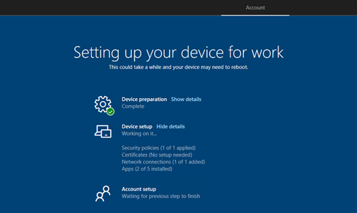

# Device Use Shall be restricted until required applications are installed

## Description

When a user is first onboarding to a new device, required applications, such as your AV or Endpoint protection software, should be allowed to install before the user begins to access the device. This setting can be configured as part of the enrollment status page for people enrolling Windows devices and signing in for the first time.

## Policy

* Device Use Shall be restricted until required applications are installed

## Licensing Considerations

• Any tenant with Intune licensing can access this setting.

## Set-Up Instructions

[Set up the Enrollment Status Page in the admin center - Microsoft Intune | Microsoft Learn](https://learn.microsoft.com/en-us/mem/intune/enrollment/windows-enrollment-status)

[Selecting Required Apps for your Enrollment Status Page - Microsoft Community Hub](https://techcommunity.microsoft.com/t5/intune-customer-success/selecting-required-apps-for-your-enrollment-status-page/ba-p/2200381)

## End-User Impact


Level: <mark style="color:yellow;">Medium</mark>


This will vary depending on the applications being installed. Its possible the user will have to wait some time for the applications to finish installing. For this reason, its best to define the minimum blocking applications as part of the settings and not make this the full list that will be installed.


Tips

None Currently


## PowerShell Scripts

None Currently

## Videos&#x20;






