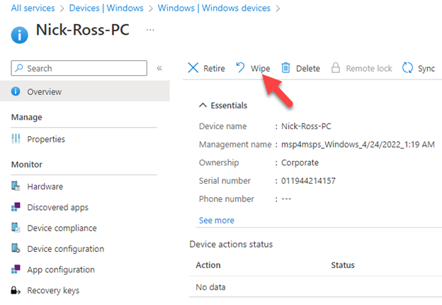

# Devices and Applications shall be wiped when a user leaves the organization or reports a lost/stolen

## Description

Standard operating procedures should be put into place to remotely wipe devices and applications when a user leaves the organization or a device is lost or stolen.

## Policy

* Devices and Applications shall be wiped when a user leaves the organization or reports a lost/stolen device

## Licensing Considerations

• Any tenant with Intune licensing can access this setting.

## Set-Up Instructions

[Retire or wipe devices using Microsoft Intune | Microsoft Learn](https://learn.microsoft.com/en-us/mem/intune/remote-actions/devices-wipe)

[How to wipe only corporate data from apps - Microsoft Intune | Microsoft Learn](https://learn.microsoft.com/en-us/mem/intune/apps/apps-selective-wipe)

## End-User Impact


Level: <mark style="color:green;">None</mark>


There should be no user impact here unless the actions to remotely wipe a device or application is done in error where the user should not have had that action performed against their device.


Tips

None Currently


## PowerShell Scripts

None Currently

## Videos&#x20;








