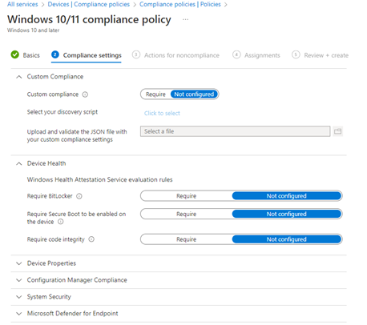

# Devices compliance policies shall be configured for every supported device platform

## Description

Device compliance policies allow us to define the necessary settings on a particular platform that meets corporate requirements. Device compliance policies paired with conditional access policies allow us to prevent access to corporate resources on noncompliant devices. Devices should be constantly monitored to ensure compliance with corporate policies.

## Policy

* A device compliance policy is configured for each device platform that is supported by the corporation.
* Devices that do not meet the compliance standards shall be marked as noncompliant immediately

## Licensing Considerations

Any tenant with Intune licensing can access this setting.

## Set-Up Instructions

[Device compliance policies in Microsoft Intune | Microsoft Learn](https://learn.microsoft.com/en-us/mem/intune/protect/device-compliance-get-started)

To configure device compliance policies by platform:

[Windows](https://learn.microsoft.com/en-us/mem/intune/protect/compliance-policy-create-windows)

[macOS](https://learn.microsoft.com/en-us/mem/intune/protect/compliance-policy-create-mac-os)

[iOS/iPadOS](https://learn.microsoft.com/en-us/mem/intune/protect/compliance-policy-create-ios)

[Android device administrator](https://learn.microsoft.com/en-us/mem/intune/protect/compliance-policy-create-android)

[Android (AOSP)](https://learn.microsoft.com/en-us/mem/intune/protect/compliance-policy-create-android-aosp)

[Android Enterprise](https://learn.microsoft.com/en-us/mem/intune/protect/compliance-policy-create-android-for-work)

## End-User Impact


Level: <mark style="color:yellow;">Medium</mark>


Device compliance policies will have no impact to end-users unless they are paired with conditional access policies to block access on noncompliant devices. Devices not in compliance will show up in the Intune admin center from a reporting standpoint. There are certain device compliance policy settings that will prompt the end-user for certain action. For instance, configuring Encryption of data storage on the device will prompt the user to configure Bitlocker encryption if it is not already enabled. It is recommended to push out a configuration profile to automatically configure encryption in this use case to avoid help desk calls.


Tips

•Device compliance policy settings might vary depending on the organization but should be standardized where possible.


## PowerShell Scripts

[powershell-intune-samples/CompliancePolicy at master · microsoftgraph/powershell-intune-samples (github.com)](https://github.com/microsoftgraph/powershell-intune-samples/tree/master/CompliancePolicy)

## Videos&#x20;






