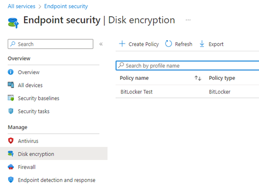

# Encryption shall be required on all devices

## Description

Disk encryption shall be configured on all corporate owned devices. Encryption of corporate data should also be configured at an application layer where applicable. In the Endpoint Manager Admin center, there is multiple locations to configure device encryption:

**Endpoint Security>Disk Encryption**: Allows you to configure encryption settings for FileVault (macOS) and Bitlocker (Windows).

**Configuration Profiles**: Endpoint Protection (Windows Encryption, FileVault), Device Restrictions (iOS, Android)

**App Protection Policies** (For application data encryption): iOS and Android

## Policy

* Disk encryption shall be required on all devices

## Licensing Considerations

• Any tenant with Intune licensing can access this setting.

## Set-Up Instructions

Disk Encryption: [Manage disk encryption with endpoint security policies in Microsoft Intune | Microsoft Learn](https://learn.microsoft.com/en-us/mem/intune/protect/endpoint-security-disk-encryption-policy)

Configuration Profiles: [Configure Endpoint protection settings in Microsoft Intune | Microsoft Learn](https://learn.microsoft.com/en-us/mem/intune/protect/endpoint-protection-configure#create-a-device-profile-containing-endpoint-protection-settings)

App Protection Policies:

* [iOS/iPadOS app protection policy settings - Microsoft Intune | Microsoft Learn](https://learn.microsoft.com/en-us/mem/intune/apps/app-protection-policy-settings-ios)
* [Android app protection policy settings - Microsoft Intune | Microsoft Learn](https://learn.microsoft.com/en-us/mem/intune/apps/app-protection-policy-settings-android)

## End-User Impact


Level: <mark style="color:green;">Low</mark>


If configured correctly, the end user should have no interaction with configuring encryption on the device. Leveraging configuration profiles or disk encryption settings should automatically configure the device encryption. There could be a use case where the configuration fails and the end user is prompted to fix on their device.\


Tips

Make sure you don’t have conflicting policies between configuration profiles, security baselines, compliance policies, and disk encryption profiles

As a best practice, its best to push out the configuration profiles for disk encryption before enforcing any compliance policies that require device encryption. This will ensure that the encryption is silently configured an the user does not get prompted to set that up on their own.


## PowerShell Scripts

None Currently

## Videos&#x20;








