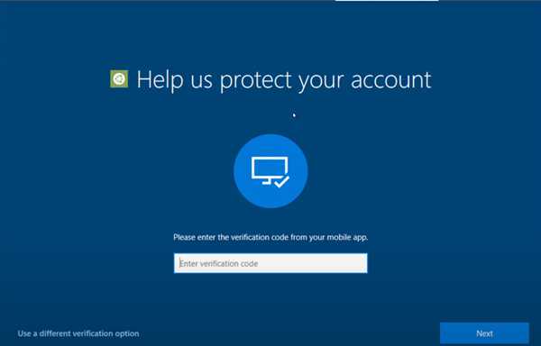

# MFA Shall be required for Intune Enrollment

## Description

You can use Intune together with Azure Active Directory (Azure AD) conditional access policies to require multifactor authentication (MFA) during device enrollment. If you require MFA, employees and students wanting to enroll devices must first authenticate with a second device and two forms of credentials. We do not want unauthorized users joining devices to our network.

## Policy

* • MFA Shall be required to enroll devices into Intune

## Licensing Considerations

This setting requires at least an Azure AD P1 license which comes standalone or as part of the following bundles:

* EMS+E3/E5
* Microsoft 365 Business Premium
* Microsoft 365 E3
* Microsoft 365 E5

## Set-Up Instructions

[Require multifactor authentication for Intune device enrollment - Microsoft Intune | Microsoft Learn](https://learn.microsoft.com/en-us/MEM/intune/enrollment/multi-factor-authentication#configure-intune-to-require-multifactor-authentication-at-device-enrollment)

## End-User Impact


Level: <mark style="color:yellow;">Medium</mark>


Users must satisfy the MFA prompt in order to be able to successfully enroll a device. For users signing in for the very first time who have not configured MFA methods, a temporary access pass can be used: [Configure a Temporary Access Pass in Azure AD to register Passwordless authentication methods - Microsoft Entra | Microsoft Learn](https://learn.microsoft.com/en-us/azure/active-directory/authentication/howto-authentication-temporary-access-pass)


Tips

For users signing in for the very first time who have not configured MFA methods, a temporary access pass can be used: [Configure a Temporary Access Pass in Azure AD to register Passwordless authentication methods - Microsoft Entra | Microsoft Learn](https://learn.microsoft.com/en-us/azure/active-directory/authentication/howto-authentication-temporary-access-pass)


## PowerShell Scripts

[azure-ad-conditional-access-apis/readme.md at main · Azure-Samples/azure-ad-conditional-access-apis (github.com)](https://github.com/Azure-Samples/azure-ad-conditional-access-apis/blob/main/01-configure/powershell/readme.md)

## Videos&#x20;


