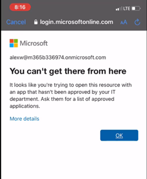

# Mobile devices shall only be able to access corporate data through approved client apps

## Description

Conditional Access policies can be set up to only allow access to corporate data on [client approved apps.](https://learn.microsoft.com/en-us/azure/active-directory/conditional-access/concept-conditional-access-grant#require-approved-client-app) This setting would prevent a user from leveraging the native mail client on their mobile application. A client that you are not able to control or wipe if they leave the organization.

## Policy

* Mobile devices shall only be able to access corporate data through approved client apps

## Licensing Considerations

This setting requires at least an Azure AD P1 license which comes standalone or as part of the following bundles:

* EMS+E3/E5
* Microsoft 365 Business Premium
* Microsoft 365 E3
* Microsoft 365 E5

## Set-Up Instructions

1. Follow the steps [outlined here](https://tminus365com-my.sharepoint.com/personal/msp4msps\_tminus365\_com/Documents/Project%20Capsule/Mobile%20devices%20shall%20only%20be%20able%20to%20access%20corporate%20data%20through%20approved%20client%20apps) to create a conditional access policy that requires approved client apps for mobile devices.
2. In the Access Controls, only select the Required Approved Client App settings\

\*Note\* You may chose to app the require app protection policy setting here as well but it will required that these devices enroll in the MDM solution. More information here: [Grant controls in Conditional Access policy - Azure Active Directory - Microsoft Entra | Microsoft Learn](https://learn.microsoft.com/en-us/azure/active-directory/conditional-access/concept-conditional-access-grant#require-app-protection-policy)

## End-User Impact


Level: <mark style="color:yellow;">Medium</mark>


If a user goes to access corporate data on an unapproved client app, like the native mail app on the mobile device, they will be redirected to the Apple Store or Google Play store to download the approved client app (in this case, Outlook).\


Tips

App Protection policies can be scoped to managed or unmanaged devices. If you have them scoped to managed devices, its likely you will want to include the “Require App Protection Policy” setting in the grant controls of the conditional access policy


## PowerShell Scripts

None Currently

## Videos&#x20;


