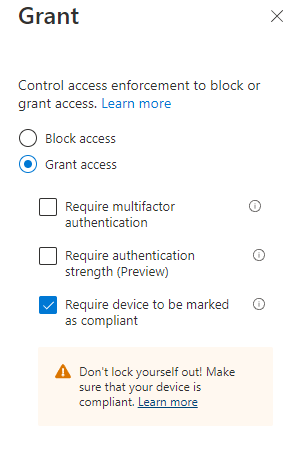
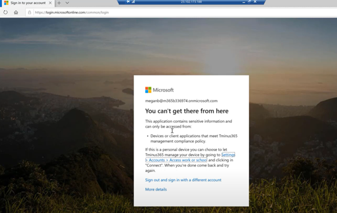

# Noncompliant devices shall be blocked from accessing corporate resources

## Description

Device compliance policies allow us to define the necessary settings on a particular platform that meets corporate requirements. Device compliance policies paired with conditional access policies allow us to prevent access to corporate resources on noncompliant devices. Devices that are not in compliance should not have access to corporate resources.

## Policy

* Noncompliant devices shall not be able to access corporate resources

## Licensing Considerations

This setting requires at least an Azure AD P1 license which comes standalone or as part of the following bundles:

* EMS+E3/E5
* Microsoft 365 Business Premium
* Microsoft 365 E3
* Microsoft 365 E5

## Set-Up Instructions

[Device compliance policies in Microsoft Intune | Microsoft Learn](https://learn.microsoft.com/en-us/mem/intune/protect/device-compliance-get-started)

To configure a conditional access policy for compliant devices:

1. Follow the steps [outlined here](https://learn.microsoft.com/en-us/mem/intune/protect/create-conditional-access-intune) to create a conditional access policy
2. Under the assignments section, Include all users. Be sure to Exclude a break-glass account to ensure you never lock yourself out.
3. Under the Cloud Apps section, include all cloud apps
4. Do not configure anything in the conditions section
5. Under the Grant section, choose Require device to be marked as compliant

## End-User Impact


Level: <mark style="color:red;">High</mark>


Any user that is trying to access corporate data on a device not marked as compliant shall receive a message letting them know they are blocked and will be told to contact IT. This includes both devices enrolled into Intune and marked as noncompliant as well as devices that are not enrolled at all into the solution.


Tips

A formal process definition should be in place for investigating noncompliant devices. Common use cases for noncompliant triggers should be documented to expedite resolution

Automation should be put in place where possible to alert on noncompliant devices in order to be more proactive.

Users should have way to readily contact support that is not through email as they will not have access to enter outlook


## PowerShell Scripts

[azure-ad-conditional-access-apis/readme.md at main · Azure-Samples/azure-ad-conditional-access-apis (github.com)](https://github.com/Azure-Samples/azure-ad-conditional-access-apis/blob/main/01-configure/powershell/readme.md)

## Videos&#x20;


