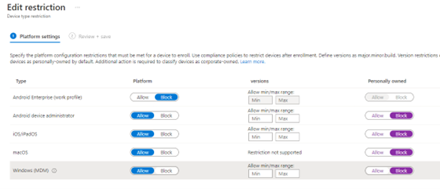

# Personal Devices should be restricted from enrolling into the MDM solution

## Description

By default, any device can enroll into Intune whether or not it is classified as corporate or personal. To prevent device users from accidently enrolling their personal device, device restrictions should be configured. Users should only be enrolling corporate owned devices that have specifications that meet corporate standards.

## Policy

* Device restrictions should be configured to restrict personal devices from enrolling in the MDM solution
* Only device types (i.e. Windows, Linux, macOS, etc.) defined by the corporation shall be supported for Intune enrollment

## Licensing Considerations

Any tenant with Intune licensing can access this setting.

## Set-Up Instructions

[Overview of enrollment restrictions - Microsoft Intune | Microsoft Learn](https://learn.microsoft.com/en-us/mem/intune/enrollment/enrollment-restrictions-set)

[Create device platform restrictions - Microsoft Intune | Microsoft Learn](https://learn.microsoft.com/en-us/mem/intune/enrollment/create-device-platform-restrictions)

To block personally owned devices from enrolling into Intune:

1. Follow the steps outlined [here](https://learn.microsoft.com/en-us/mem/intune/enrollment/create-device-platform-restrictions)
2. Under Personally-Owned, select Block for each device type

## End-User Impact


Level: <mark style="color:yellow;">Medium</mark>


Users will not be able to enroll any device that is classified as personal. If you have Windows autoenrollment enabled, users will be prompted to enroll their devices when access common office applications like Teams. If they select Yes to enroll the device and the device is personally owned, they will be prevented from enrolling that device.


Tips

• If you have a Conditional Access Policy set up to block legacy authentication, this setting is not necessary


## PowerShell Scripts

[powershell-intune-samples/EnrollmentRestrictions at master · microsoftgraph/powershell-intune-samples (github.com)](https://github.com/microsoftgraph/powershell-intune-samples/tree/master/EnrollmentRestrictions)

## Videos&#x20;



