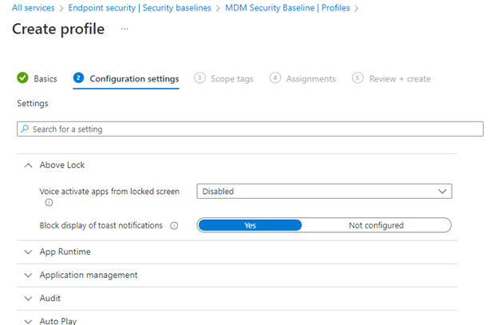

# Security Baselines should be configured for Windows Devices

## Description

Security baselines in Intune are pre-configured groups of settings that are best practice recommendations from the relevant Microsoft security teams for the product. Intune supports security baselines for Windows 10/11 device settings, Microsoft Edge, Microsoft Defender for Endpoint Protection, and more.

You can use security baselines to rapidly deploy a _best practice_ configuration of device and application settings to protect your users and devices. Security baselines are supported for devices that run Windows 10 version 1809 and later, and Windows 11. These baselines allow you to configure common security settings such as:

* Password Requirements
* Lock screen settings
* App Installation

## Policy

* Security Baselines should be configured for Windows Devices

## Licensing Considerations

Any tenant with Intune licensing can access this setting.

## Set-Up Instructions

[https://learn.microsoft.com/en-us/mem/intune/protect/security-baselines-configure](https://learn.microsoft.com/en-us/mem/intune/protect/security-baselines-configure)

## End-User Impact


Level: <mark style="color:yellow;">Medium</mark>


Its possible that some of the settings pre-configured as part of the security baseline profile will be disruptive to end-users. As a best practice, proper testing should be done leveraging a device on the corporate network and testing this out with a pilot group of users before broad deployment.


Tips

Security baselines are one of several methods in Intune to configure settings on devices. When managing settings, it's important to understand what other methods are in use in your environment that can configure your devices so you can avoid conflicts. See [Avoid policy conflicts](https://learn.microsoft.com/en-us/mem/intune/protect/endpoint-security#avoid-policy-conflicts) later in this article.


## PowerShell Scripts

[powershell-intune-samples/EndpointSecurity at master · microsoftgraph/powershell-intune-samples (github.com)](https://github.com/microsoftgraph/powershell-intune-samples/tree/master/EndpointSecurity)

[Creating Endpoint Security Policies with PowerShell | Powers Hell (powers-hell.com)](https://powers-hell.com/2020/04/21/creating-endpoint-security-policies-with-powershell/)

## Videos&#x20;




