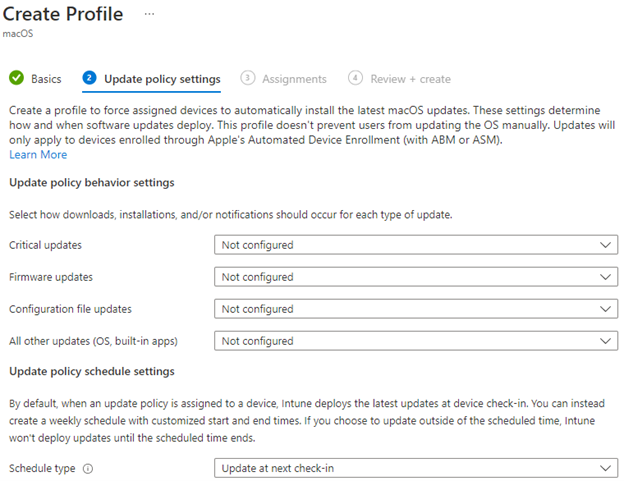

# Update Policies shall be configured for Apple Devices

## Description

You can use Microsoft Intune to manage software updates for macOS, iOS, and iPad devices that enrolled as [supervised devices](https://learn.microsoft.com/en-us/mem/intune/enrollment/macos-enroll#user-approved-enrollment). Just like the Windows update rings in the previous section, we can leverage these policies to manage the patch cycle on Apple devices enrolled into Intune.

## Policy

* Update policies are configured for macOS, iOS, and iPad Devices

## Licensing Considerations

Any tenant with Intune licensing can access this setting.

## Set-Up Instructions

[Use Microsoft Intune policies to manage macOS software updates | Microsoft Learn](https://learn.microsoft.com/en-us/mem/intune/protect/software-updates-macos#configure-the-policy)

[Use Microsoft Intune policies to manage iOS/iPadOS software updates | Microsoft Learn](https://learn.microsoft.com/en-us/mem/intune/protect/software-updates-ios#configure-the-policy)

## End-User Impact


Level: <mark style="color:yellow;">Medium-</mark><mark style="color:red;">High</mark>


Patching has always been notorious for being disruptive to end-users. When you configure the update policies, you can define specific time periods where updates will try to be deployed. This is typically in the after hours of business. When you use update policies for macOS, you might want to hide updates from users of supervised macOS devices for a period of time. You can accomplish this with a settings catalog policy for macOS devices that configure update restriction periods. You can follow these instructions to configure these settings: [Use Microsoft Intune policies to manage macOS software updates | Microsoft Learn](https://learn.microsoft.com/en-us/mem/intune/protect/software-updates-macos#delay-visibility-of-updates)\


Tips

The Install immediately setting is the most user-impactful setting as it will reboot the computer immediately.


## PowerShell Scripts

[powershell-intune-samples/SoftwareUpdates at master · microsoftgraph/powershell-intune-samples (github.com)](https://github.com/microsoftgraph/powershell-intune-samples/tree/master/SoftwareUpdates)

## Videos&#x20;


