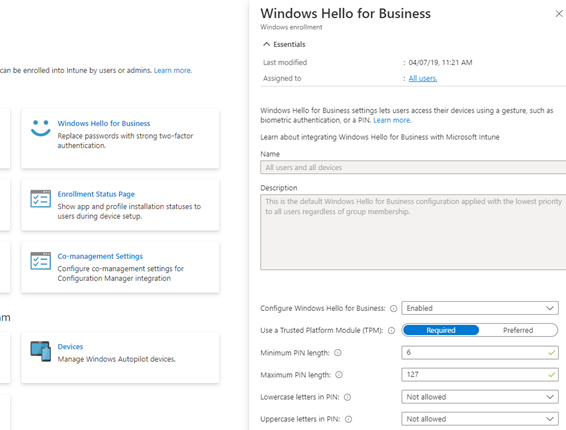

# Windows Hello for Business should be configured where applicable

## Description

For Windows 10/11 devices, use of Windows Hello for Business replaces the use of passwords with strong two-factor authentication on devices. This authentication consists of a user credential that’s tied to a device and uses a biometric or PIN.

## Policy

* Windows Hello for Business should be configured where applicable

## Licensing Considerations

• Any tenant with Intune licensing can access this setting.

## Set-Up Instructions

Configure Windows Hello at the time of enrollment: [Configure a tenant-wide Windows Hello for Business policy with Microsoft Intune - Microsoft Intune | Microsoft Learn](https://learn.microsoft.com/en-us/mem/intune/protect/windows-hello)

Configure Windows Hello after device enrollment: [Deploy policy for Windows Hello to groups of Windows 10 and Windows 11 devices in Microsoft Intune | Microsoft Learn](https://learn.microsoft.com/en-us/mem/intune/protect/identity-protection-configure)

## End-User Impact


Level: <mark style="color:green;">Low</mark>


Users will be prompted to set up facial recognition or fingerprint depending on the device. Users will also be asked to establish a pin in case that biometric authentication fails or cannot be accessed.


Tips

None Currently


## PowerShell Scripts

[powershell-intune-samples/DeviceConfiguration at master · microsoftgraph/powershell-intune-samples (github.com)](https://github.com/microsoftgraph/powershell-intune-samples/tree/master/DeviceConfiguration)

## Videos&#x20;




