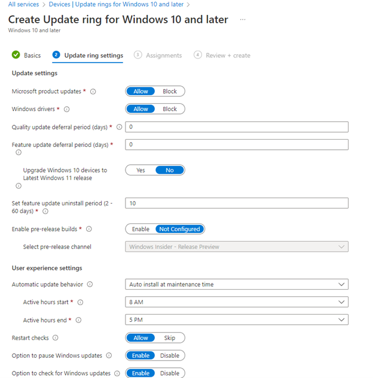

# Windows Update Rings shall be configured for Windows Devices

## Description

Windows update rings, also known as Windows Update for Business allow you to manage the patch cycle across Windows devices in your organization.

Updates should be staggered across devices in your organization in order to manage any new features or bugs as part of the new update. Critical updates should be deployed immediately to all devices leveraging the Windows update ring service.

If you are an enterprise customer, [Windows Autopatch](https://learn.microsoft.com/en-us/windows/deployment/windows-autopatch/overview/windows-autopatch-overview) is another feature that can automate your deployment of Windows update rings.

## Policy

* Windows update rings are configured and assigned to all windows devices

## Licensing Considerations

Any tenant with Intune licensing can access this setting.&#x20;

OS Requirements: [Configure Update rings for Windows 10 and later policy in Intune | Microsoft Learn](https://learn.microsoft.com/en-us/mem/intune/protect/windows-10-update-rings#prerequisites)

Windows Autopatch Prerequisites: [Prerequisites - Windows Deployment | Microsoft Learn](https://learn.microsoft.com/en-us/windows/deployment/windows-autopatch/prepare/windows-autopatch-prerequisites)

## Set-Up Instructions

[Configure Update rings for Windows 10 and later policy in Intune | Microsoft Learn](https://learn.microsoft.com/en-us/mem/intune/protect/windows-10-update-rings#create-and-assign-update-rings)

## End-User Impact


Level: <mark style="color:yellow;">Medium-</mark><mark style="color:red;">High</mark>


Patching has always been notorious for being disruptive to end-users. When you configure the Windows update rings, you can define specific time periods where updates will try to be deployed. This is typically in the after hours of business. You can also decide how long end-users can defer updates before they are forced to install them. There will always be use cases where you also have to uninstall updates due to those updates having bugs or disrupting some type of line of business application.


Tips

Have a defined process in place for when you need to roll back updates or when you need to push out critical updates to all devices.

In your broad deployment, make sure the quality or deferred updates are pushed out at least 14 days to avoid more frequent rollbacks.


## PowerShell Scripts

[powershell-intune-samples/SoftwareUpdates at master · microsoftgraph/powershell-intune-samples (github.com)](https://github.com/microsoftgraph/powershell-intune-samples/tree/master/SoftwareUpdates)

## Videos&#x20;




