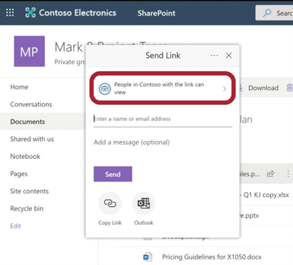

# External Sharing SHOULD be Set to “New and Existing Guests”

## Description

SharePoint allows sharing with users who are outside the agency, which is convenient but may pose a data loss or other information security risk. This working group recommends allowlisting by domains and security groups per interagency collaboration needs. Note: Adjusting this setting will adjust external sharing for OneDrive and Teams to the same, selected level. OneDrive and Teams can be less permissive (not more permissive) than SharePoint Online. Adding approved domains and/or security groups will also be reflected in One Drive external sharing settings.

## Policy

External sharing SHOULD be limited to approved domains and security groups per interagency collaboration needs.

## Licensing Considerations

Any tenant with SharePoint online licensing can access this setting.

## Set-Up Instructions

[Manage sharing settings - SharePoint in Microsoft 365 | Microsoft Learn](https://learn.microsoft.com/en-us/sharepoint/turn-external-sharing-on-or-off)

To adjust sharing settings, in the SharePoint admin center:

1. Select Policies -> Sharing.
2. Adjust external sharing slider to New and Existing Guests.
3. Expand More external sharing settings.
4. Select Limit external sharing by domain.
5. Select Add domains.
6. Add domains.
7. Select Save.
8. Select Allow only users in specific security groups to share externally.
9. Select Manage security groups.
10. Add security groups.
11. Select Save.

## End-User Impact


Level: <mark style="color:red;">High</mark>


With this setting enabled, users will not be able to share external links unless:

* External users are added as guest to the organization
* External user domains are added to the SharePoint setting
* Users are added to the specified security groups so they can send to external users


Tips

• There should be a formal request process for adding domains and being added to a security group.


## PowerShell Scripts

[Set-SPOTenant (Microsoft.Online.SharePoint.PowerShell) | Microsoft Learn](https://learn.microsoft.com/en-us/powershell/module/sharepoint-online/Set-SPOTenant?view=sharepoint-ps)

## Videos&#x20;



