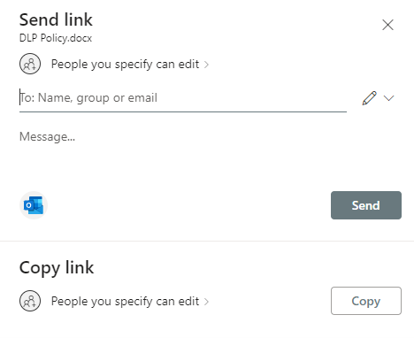

# File and Folder Links Default Sharing Settings SHALL Be Set to Specific People

## Description

This policy ensures that when sharing files in SharePoint, there are several possible scopes, including agency-wide or “anyone with the link.”

## Policy

File and folder links default sharing setting SHALL be set to “Specific People (Only the People the User Specifies).”

## Licensing Considerations

Any tenant with SharePoint online licensing can access this setting.

## Set-Up Instructions

[Manage sharing settings - SharePoint in Microsoft 365 | Microsoft Learn](https://learn.microsoft.com/en-us/sharepoint/turn-external-sharing-on-or-off#file-and-folder-links)

In the SharePoint admin center:

1. In the left-hand navigation bar, click Policies -> Sharing to display sharing settings.
2. Under File and folder links, ensure that the default link type is set to Specific people (only the people the user specifies).

## End-User Impact


Level: <mark style="color:green;">Low</mark>


With this setting enabled, users will have to specify users that can access the link. If the link is forwarded to other users internally or externally, those users will not be able to access the link.


Tips

None Currently


## PowerShell Scripts

[Set-SPOTenant (Microsoft.Online.SharePoint.PowerShell) | Microsoft Learn](https://learn.microsoft.com/en-us/powershell/module/sharepoint-online/Set-SPOTenant?view=sharepoint-ps)

## Videos&#x20;



