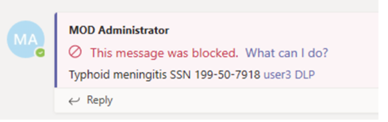

# Data Loss Prevention Solutions SHALL Be Enabled

## Description

Data loss prevention (DLP) helps prevent both accidental leakage of sensitive information as well as intentional exfiltration of data. DLP forms an integral part of securing Microsoft Teams. There a several commercial DLP solutions available that document support for Microsoft Teams. Agencies may select any service that fits their needs and meets the requirements outlined in this baseline control.

## Policy

* A DLP solution SHALL be enabled.
* Organizations SHOULD use either the native DLP solution offered by Microsoft or a DLP solution that offers comparable services.
* The DLP solution SHALL protect Personally Identifiable Information (PII) and sensitive information, as defined by the agency. At a minimum, the sharing of credit card numbers, taxpayer Identification Numbers (TIN), and Social Security Numbers (SSN) via email SHALL be restricted.

## Licensing Considerations

Data loss prevention policies can be configured with the following plans:

* Microsoft 365 Business Premium
* Office 365 E5/A5/G5
* Microsoft 365 E5/A5/G5
* Microsoft 365 E5/A5/G5 Information Protection and Governance
* Microsoft 365 E5/A5/G5/F5 Compliance and F5 Security & Compliance

## Set Up Instructions

Resources:

[Data loss prevention and Microsoft Teams - Microsoft Purview (compliance) | Microsoft Learn](https://learn.microsoft.com/en-us/microsoft-365/compliance/dlp-microsoft-teams?view=o365-worldwide)

To create a DLP policy for Teams follow the steps listed [here](https://learn.microsoft.com/en-us/microsoft-365/compliance/dlp-microsoft-teams?view=o365-worldwide#define-a-new-dlp-policy-for-microsoft-teams)

## End-User Impact


Level: <mark style="color:yellow;">Medium</mark>


When DLP policies are in place any user trying to share sensitive information as defined by the policy will be blocked.

[Teams messages about data loss prevention (DLP) and communication compliance policies - Microsoft Support](https://support.microsoft.com/en-us/office/teams-messages-about-data-loss-prevention-dlp-and-communication-compliance-policies-c5631c3f-f61b-4306-a6ac-6603d9fc5ff0)


Tips

To ensure organizational compliance, its recommended send end-user communications before turning the policy on. Educate users on how to properly share sensitive information.


## PowerShell Scripts

[How to Create and Manage DLP policies using PowerShell » Jorge Bernhardt](https://www.jorgebernhardt.com/create-manage-dlp-policies/)

[New-DlpCompliancePolicy (ExchangePowerShell) | Microsoft Learn](https://learn.microsoft.com/en-us/powershell/module/exchange/new-dlpcompliancepolicy?view=exchange-ps)

## Videos






